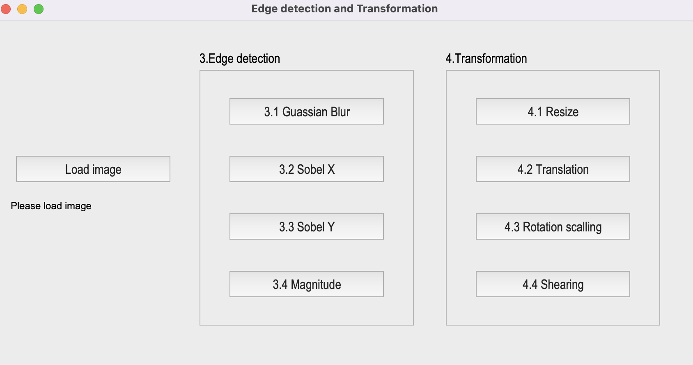
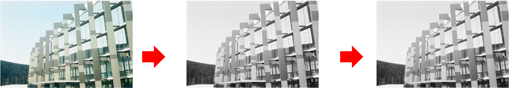
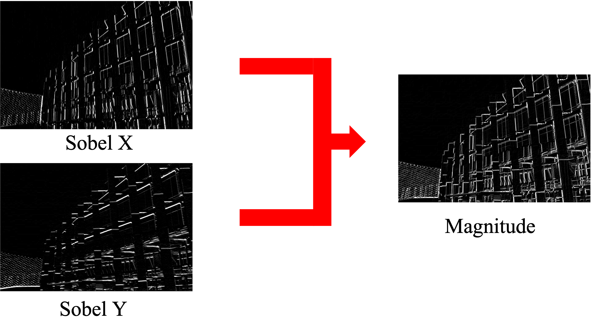
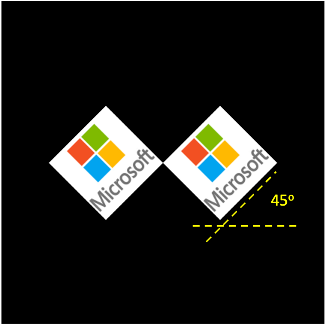

# OpenCV-Computer-Vision Practice two

*Discription:*

***1.This is just a small second project that we want to practice the basic image processing skills for computer vision.***

***2.This topic was focus on image processing over edge detection and image Transformation.***

**1.Requirements and dependencies**
  * Python 3.7 (https://www.python.org/downloads/)
  * Opencv-contrib-python (3.4.2.17)
  * Matplotlib 3.1.1
  * UI framework: pyqt5 (5.15.1)

**2.Usage:**

1. Downloads whole repository and change path into the main folder
2. Run `python start.py` .
3. Input the image.
4. Run the whole code.

**3.Feature:**

1.Edge detection

* 3.1 Guassian Blur :
  
    * Convert the RGB image [Build.jpg](Figures/Building.jpg) into a grayscale image, then smooth it by your own 3x3 Gaussian smoothing filter .
      
      
* 3.2 Sobel X:
  
    * Use Sobel edge detection to detect vertical edge by your own 3x3 Sobel X operator.
      
      
* 3.3 Sobel Y
  
    * Use Sobel edge detection to detect horizontal edge by your own 3x3 Sobel Y operator.

     
* 3.4 Magnitude
  
   * Use the results of (3.2) Sobel X and (3.3) Sobel Y to calculate the magnitude.

     
 
2.Image Transformation

* 4.1 Resize
  
   * From (430,430) to (215,215).

     

* 4.2 Translation
  
   * Xnew = Xold + 215 pixels = 108 + 215 = 323.
   * Ynew = Yold + 215 pixels = 108 + 215 = 323.
   * Point C (108, 108) is center of resized image.
   * Point C’(323, 323) is new center of image. 

     

* 4.3 Rotation scalling
   * Center: Center of Image.
   * Angle = 45 $^{\circ}$ (counter-clockwise).
   * Scale = 0.5.
   * window size (430,430)

     
  
* 4.4 Shearing
   * Old location: ([[50,50],[200,50],[50,200]])
   * New location: ([[10,100],[100,50],[100,250]]) 

     

